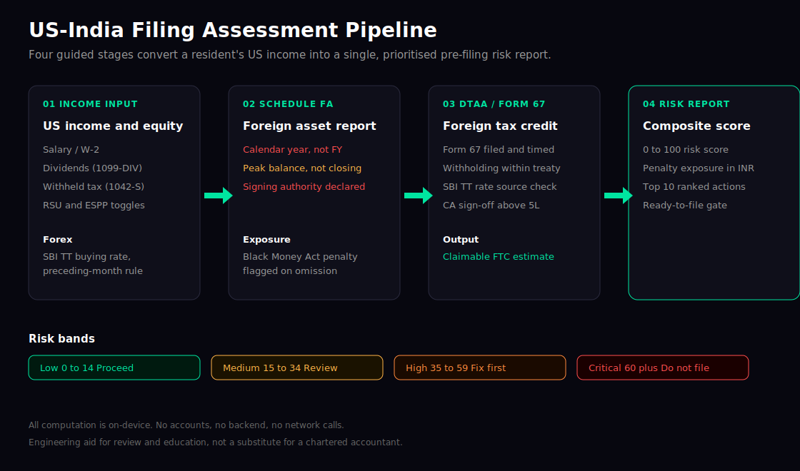
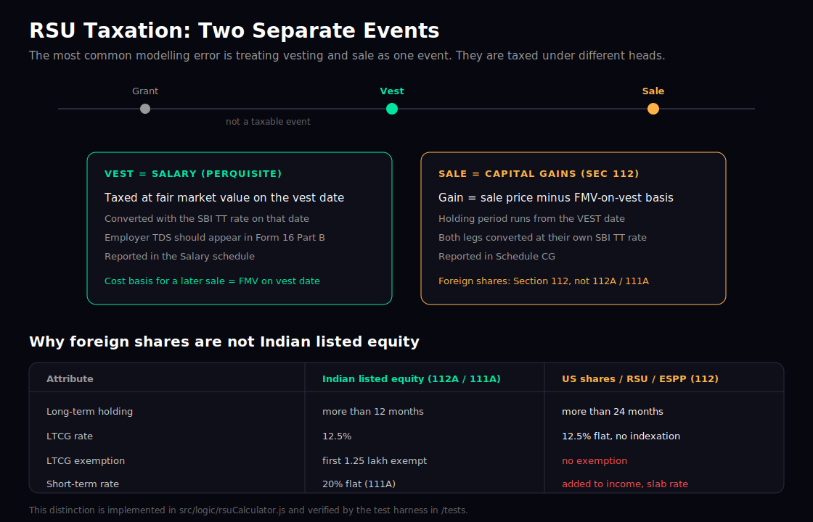

# IndTaxPro

A mobile tax-filing assistant for Indian residents who hold US income: RSUs, ESPPs, dividends, and foreign brokerage accounts. It walks a user through the four places this kind of return goes wrong, converts every US figure with the correct official exchange rate, and produces a single pre-filing risk report with the penalty exposure in rupees.


**Live web demo:** https://aneeshk-ds.github.io/indtaxpro/ (the same React Native code, exported to the web with Expo and deployed to GitHub Pages by a CI workflow)



---

## The problem

A salaried engineer in India with vested US RSUs has to get four separate things right, each with its own deadline and penalty:

1. Schedule FA, the foreign-asset disclosure, which uses the calendar year and the peak balance, not the fiscal year and the closing balance.
2. The Foreign Tax Credit through Form 67 and the India-US DTAA, so the same income is not taxed twice.
3. The split between an RSU vesting (salary) and an RSU sale (capital gains), which are two events taxed under two heads.
4. Currency conversion using the SBI Telegraphic Transfer buying rate for the month preceding the income, which the tax department expects and most people get wrong.

Mainstream filing tools assume domestic income and skip most of this. IndTaxPro is built specifically for the cross-border case.

## What it does

- Guided US-income flow: income input, Schedule FA check, DTAA and Form 67 check, then a composite risk report.
- Schedule FA validation for the three failure points: calendar-year vs fiscal-year, peak balance vs closing balance, and undeclared signing authority, with Black Money Act exposure surfaced.
- DTAA and Form 67 checks: filing presence and timing, withholding within the treaty rate, exchange-rate source, and the CA digital-signature trigger above 5 lakh, with an estimated claimable Foreign Tax Credit.
- RSU and ESPP calculator that separates the vesting perquisite from the capital gain, lot by lot, with the holding period measured from the vest date.
- SBI TT rate lookup that applies the preceding-month rule automatically and flags any rate more than 1% off the official figure.
- Standard flow as well: an ITR-form selector and an Old vs New regime comparator for FY 2025-26.
- Composite risk score from 0 to 100 with a ranked action list and a ready-to-file gate.

The interface is organised into a bottom tab bar (US Filing, Indian Tax, Learn) with each long screen split into collapsible accordion sections, so a user sees one focused step at a time rather than one long scroll.

All computation runs on the device. There is no backend, no account, and no network call.

## RSU and foreign-share treatment

The hardest part to get right, and the part this project treats as its anchor, is that US shares are not Indian listed equity. They are taxed under Section 112, with a 24-month long-term holding period, no 1.25 lakh exemption, and short-term gains at the slab rate.



---

## Architecture

```
src/
  logic/          Pure tax, forex, and validation functions (no UI, no I/O)
  screens/
    us/           US flow: IncomeInput -> ScheduleFA -> DTAA -> RiskReport (+ RSU calculator)
    standard/     Standard flow: ITRSelector -> RegimeComparator
  components/     RiskBadge, ChecklistItem, InfoCard
  navigation/     React Navigation native stack
  theme/          Colours, typography, spacing
tests/            Logic verification suite (esbuild + Node)
docs/             Engineering review and infographics
```

Keeping every calculation in `src/logic/` as a pure function is a deliberate choice: it makes the tax logic testable without rendering a single screen, which is what let the review below run as automated assertions.

### Tax logic modules

| File | Responsibility |
|---|---|
| `taxRates.js` | FY 2025-26 slabs, regime-aware surcharge, cess, DTAA rates, capital-gains constants, slab calculator |
| `scheduleFAValidator.js` | Calendar-year, peak-balance, and signing-authority checks |
| `dtaaChecker.js` | Form 67 presence and timing, withholding-rate check, FTC computation |
| `rsuCalculator.js` | RSU vesting (salary) vs sale (Section 112 capital gains), ESPP discount vs gain |
| `sbiRates.js` | SBI TT buying-rate lookup with the preceding-month rule |
| `riskScorer.js` | Aggregates all validators into a 0 to 100 score and a ranked action list |

## Tech stack

React Native 0.83 on Expo SDK 55, React 19, React Navigation 7, AsyncStorage. JavaScript throughout. esbuild and Node for the test suite.

---

## Quality and correctness

The logic was reviewed and tested. The full write-up, including the rule sources, is in [docs/ENGINEERING_REVIEW.md](docs/ENGINEERING_REVIEW.md). Summary:

- 24 logic assertions pass and the module set compiles.
- A secret scan found no keys, tokens, credential files, or network calls. Nothing sensitive is committed, and `.expo/` is ignored.
- Five tax-rule accuracy issues and three edge cases were identified. The high-impact ones were fixed: foreign-share capital-gains treatment (Section 112), the 25% new-regime surcharge cap, the 25% DTAA dividend rate for individuals, day-accurate holding periods, and timezone-safe date parsing for the forex lookup.

Run the suite:

```bash
npm test
```

> This project is an engineering and educational aid, not legal or tax advice. Confirm any filing decision with a chartered accountant.

---

## Running locally

Prerequisites: Node 18 or newer, and the Expo Go app on a physical device, or an emulator.

```bash
cd IndTaxPro
npm install
npx expo start
```

Scan the QR code with Expo Go, or press `a` for Android and `i` for iOS. The two `.command` files in the repo are convenience launchers for macOS that pin the SDK 55 dependency set and start the dev server.

---

## Design notes

The interface follows the patterns that work in Indian consumer-finance apps. The dark, card-based layout with one accent colour is close to CRED's visual language and suits a trust-sensitive context. The risk report borrows CRED's idea of reducing a dense topic to one headline number and a short action list. Progressive disclosure, such as revealing the CA-signature question only above the 5 lakh threshold, follows how Groww hides advanced fields until they matter.

## Roadmap

- Wire the RSU calculator output into the composite risk score.
- AsyncStorage persistence so an assessment survives an app restart.
- Live SBI TT rate fetch in place of the static lookup table.
- Marginal relief modelling for the surcharge and the 87A rebate.
- PDF export of the risk report.

## License

MIT. See [LICENSE](LICENSE).

## Author

Built by Aneesh Kumar as a portfolio project on cross-border Indian taxation and React Native engineering.
